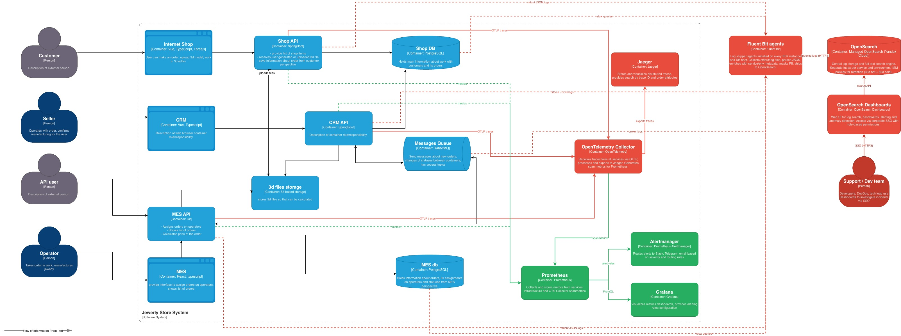

# Архитектурное решение по логированию

## 1. Анализ системы в контексте логирования

### Из каких систем требуется сбор логов

Логи нужно собирать из **всех** серверных компонентов:

1. **Shop API** (SpringBoot) — точка входа клиентов B2C, создание заказов, загрузка 3D-файлов.
2. **CRM API** (SpringBoot) — управление заказами продавцами, подтверждение производства.
3. **MES API** (C#) — расчёт стоимости, B2B API, назначение заказов на операторов.
4. **RabbitMQ** — логи брокера сообщений (подключения, ошибки, DLQ).
5. **Shop DB / MES DB** (PostgreSQL) — slow queries, ошибки, подключения.

### Список логов уровня INFO

#### Shop API

| Событие | Данные для логирования |
|---------|----------------------|
| Создание заказа | timestamp, order_id, customer_id, order_source (b2c-web) |
| Загрузка 3D-файла | timestamp, order_id, customer_id, file_size_kb, file_name, s3_key |
| Отправка заказа (SUBMITTED) | timestamp, order_id, customer_id, items_count |
| Публикация сообщения в RabbitMQ | timestamp, order_id, queue_name, message_id, correlation_id |
| Изменение статуса заказа | timestamp, order_id, status_from, status_to, customer_id |
| Получение статуса от MES (через RabbitMQ) | timestamp, order_id, status, message_id |

#### CRM API

| Событие | Данные для логирования |
|---------|----------------------|
| Подтверждение производства (MANUFACTURING_APPROVED) | timestamp, order_id, seller_id, customer_id |
| Закрытие заказа (CLOSED) | timestamp, order_id, seller_id, close_reason (delivery_confirmed/manual) |
| Получение сообщения из RabbitMQ | timestamp, order_id, queue_name, message_id, status |
| Создание заказа через B2B (из очереди MES) | timestamp, order_id, partner_id, source (b2b-api) |

#### MES API

| Событие | Данные для логирования |
|---------|----------------------|
| Получение нового заказа | timestamp, order_id, source (b2c/b2b), partner_id |
| Начало расчёта стоимости | timestamp, order_id, polygon_count, file_s3_key |
| Завершение расчёта стоимости | timestamp, order_id, price, currency, calculation_duration_ms |
| Назначение заказа на оператора (MANUFACTURING_STARTED) | timestamp, order_id, operator_id |
| Изменение статуса производства | timestamp, order_id, status_from, status_to, operator_id |
| Отправка заказа (SHIPPED) | timestamp, order_id, operator_id, tracking_number |
| Публикация сообщения в RabbitMQ | timestamp, order_id, queue_name, message_id |
| Получение запроса через B2B API | timestamp, order_id, partner_id, endpoint, method |

### Другие уровни логирования

| Уровень | Когда используется | Примеры |
|---------|-------------------|---------|
| **DEBUG** | Детальная отладка, только в dev/release-окружениях. На production отключён по умолчанию, но может быть включён через конфиг для конкретного сервиса при расследовании. | SQL-запросы с параметрами, полные тела HTTP-запросов/ответов, промежуточные шаги расчёта стоимости |
| **WARN** | Ситуация нештатная, но сервис продолжает работать. Требует внимания. | Retry при публикации в RabbitMQ, медленный запрос к БД (> 1 сек), клиент загрузил файл > 100 МБ, расчёт стоимости > 10 мин |
| **ERROR** | Ошибка, которая повлияла на результат операции. Требует расследования. | Не удалось опубликовать сообщение в RabbitMQ, ошибка записи в БД, ошибка загрузки файла в S3, таймаут расчёта, HTTP 500 |
| **FATAL** | Сервис не может продолжать работу. | Потеря связи с БД, невозможно подключиться к RabbitMQ, OOM, критическая ошибка конфигурации |

---

## 2. Мотивация

### Почему логирование необходимо

Сейчас разбор инцидентов происходит «со слов клиента»: клиент рассказывает менеджеру, менеджер передаёт разработчику, разработчик вручную ищет информацию в логах на каждом сервере. Это:
- **Медленно** — расследование занимает часы или дни.
- **Ненадёжно** — локальные логи могут быть ротированы или утеряны при перезапуске.
- **Неполно** — нет возможности коррелировать события между сервисами.

### Технические и бизнес-метрики, на которые повлияет внедрение

1. **MTTR (Mean Time To Recovery)** — время расследования инцидента сократится с часов/дней до минут. Поиск по order_id в централизованном хранилище покажет полную историю заказа.

2. **Нагрузка на поддержку** — вместо ручного обхода серверов: один запрос в Kibana/OpenSearch Dashboards. Экономия ~2-4 часов в неделю для каждого разработчика на поддержке.

3. **Количество повторных обращений клиентов** — быстрое расследование = быстрый ответ клиенту = меньше эскалаций.

4. **Обнаружение аномалий** — всплеск ERROR-логов может сигнализировать о DDoS, деградации сервиса или баге до того, как клиенты начнут жаловаться.

5. **Качество кода и архитектуры** — анализ логов покажет паттерны ошибок, позволит приоритизировать техдолг.

### Приоритет систем для логирования и трейсинга

Команда не может внедрить всё одновременно. Порядок внедрения:

| Приоритет | Система | Обоснование |
|-----------|---------|-------------|
| 1 | **MES API** | Главный источник проблем: расчёт стоимости, B2B API, взаимодействие с RabbitMQ. Максимум жалоб связано с MES. |
| 2 | **CRM API** | Подтверждение заказов, получение сообщений из RabbitMQ. Второе звено в цепочке потери заказов. |
| 3 | **Shop API** | Создание заказов, загрузка файлов. Важно для B2C, но Яндекс Метрика частично покрывает фронтенд. |
| 4 | **RabbitMQ** | Встроенные логи брокера. Подключить к централизованному хранилищу. |
| 5 | **Базы данных** | Slow query logs. Полезно, но менее критично на старте. |

---

## 3. Предлагаемое решение

### Технологический стек: OpenSearch + Fluent Bit

**Выбор: OpenSearch** (форк Elasticsearch с Apache 2.0 лицензией).

Архитектура сбора логов:

```
[Shop API] → stdout → [Fluent Bit] → [OpenSearch]
[CRM API]  → stdout → [Fluent Bit] → [OpenSearch]
[MES API]  → stdout → [Fluent Bit] → [OpenSearch]
[RabbitMQ] → log files → [Fluent Bit] → [OpenSearch]
[PostgreSQL] → log files → [Fluent Bit] → [OpenSearch]

[OpenSearch Dashboards] ← [OpenSearch] (визуализация, поиск)
```

### Компоненты

1. **Fluent Bit** (лёгкий сборщик логов):
   - Устанавливается на каждый EC2-инстанс как agent/sidecar.
   - Собирает логи из stdout приложений и log-файлов.
   - Парсит, обогащает (добавляет имя сервиса, окружение, hostname) и отправляет в OpenSearch.
   - Минимальное потребление ресурсов (~10 МБ RAM).

2. **OpenSearch** (хранилище и поисковый движок):
   - Managed OpenSearch в Yandex Cloud (снижает операционную нагрузку на DevOps).
   - Кластер: 3 data-ноды для отказоустойчивости.
   - Отдельный индекс на каждый сервис и окружение.

3. **OpenSearch Dashboards** (UI):
   - Поиск по логам: по order_id, customer_id, error message, временному диапазону.
   - Дашборды: количество ошибок по сервисам, top ошибок, активность по статусам заказов.

### Формат логов

Все сервисы должны логировать в **JSON-формате** (structured logging):

```json
{
  "timestamp": "2025-03-15T14:30:05.123Z",
  "level": "INFO",
  "service": "mes-api",
  "trace_id": "abc123def456",
  "span_id": "789ghi",
  "order_id": "ORD-2025-00042",
  "message": "Price calculation completed",
  "attributes": {
    "customer_id": "CUST-1234",
    "price": 15000.00,
    "currency": "RUB",
    "calculation_duration_ms": 145000,
    "polygon_count": 12500
  }
}
```

Ключевое: поле `trace_id` связывает лог-запись с трейсом в Jaeger. Это позволяет переходить из лога в трейс и обратно.

### Обновлённая C4-диаграмма



### Политика безопасности

**Чувствительные данные:**
- В логи НЕ попадают: ФИО, email, телефон, адрес доставки, платёжные данные, пароли, токены.
- Используются только идентификаторы: customer_id, order_id, partner_id.
- Fluent Bit настроен на фильтрацию (redact) полей, содержащих PII, через regex-фильтры.
- В Java-приложениях: кастомный Logback layout, маскирующий чувствительные поля.
- В C#-приложении: middleware для маскировки в Serilog.

**Доступ к логам:**
| Роль | Доступ |
|------|--------|
| Разработчики | Полный доступ к логам dev и release. Read-only к production-логам своих сервисов. |
| DevOps | Полный доступ ко всем логам и настройкам OpenSearch. |
| Техлид | Полный доступ ко всем логам. |
| QA | Read-only к логам dev и release. |
| PM, продавцы, операторы | Нет доступа к логам. |

### Политика хранения

Оценки ниже — **стартовые, на текущий объём заказов** (~1000/мес на момент внедрения). Бизнес растёт линейно +100 заказов/мес, плюс открыт B2B API, который даёт дополнительный скачок. За год объём логов может вырасти в 3–5 раз, поэтому:

- Retention-политики и размер кластера OpenSearch пересматриваются ежеквартально по фактическим метрикам `_cluster/stats`.
- ISM (Index State Management) автоматически переводит старые индексы на холодное хранилище, чтобы не раздувать hot-ноды.
- При превышении прогнозного объёма в 2× — увеличиваем размер кластера в Managed OpenSearch (горизонтально), а не сокращаем retention.

| Окружение | Индекс | Retention | Оценка на старте | Прогноз через 12 мес |
|-----------|--------|-----------|------------------|----------------------|
| production | `prod-shop-api-YYYY.MM` | 30 дней (hot) + 60 дней (cold) | ~5-10 ГБ/мес | ~20-40 ГБ/мес |
| production | `prod-crm-api-YYYY.MM` | 30 дней (hot) + 60 дней (cold) | ~2-5 ГБ/мес | ~8-20 ГБ/мес |
| production | `prod-mes-api-YYYY.MM` | 30 дней (hot) + 60 дней (cold) | ~10-20 ГБ/мес (B2B + расчёты) | ~40-80 ГБ/мес |
| production | `prod-rabbitmq-YYYY.MM` | 14 дней | ~1-2 ГБ/мес | ~4-8 ГБ/мес |
| production | `prod-postgresql-YYYY.MM` | 14 дней | ~1-3 ГБ/мес (только slow queries) | ~4-12 ГБ/мес |
| release | `release-*-YYYY.MM` | 14 дней | ~1-2 ГБ/мес | ~4-8 ГБ/мес |
| dev | `dev-*-YYYY.MM` | 7 дней | ~1-2 ГБ/мес | ~4-8 ГБ/мес |

**Отдельный индекс на каждый сервис** позволяет:
- Настроить разный retention для разных сервисов.
- Ограничить доступ по индексам (RBAC).
- Оптимизировать mapping (типы полей) под конкретный сервис.
- Удалять старые данные по расписанию (ISM policies в OpenSearch).

---

## 4. Система анализа логов

### Алертинг

На базе OpenSearch Alerting plugin:

| Условие | Серьёзность | Действие |
|---------|-------------|----------|
| Количество ERROR-логов > 50 за 5 минут (любой сервис) | Warning | Уведомление в Slack |
| Количество ERROR-логов > 200 за 5 минут | Critical | Звонок дежурному |
| Появление FATAL-логов | Critical | Немедленный звонок + уведомление PM |
| Сообщение в DLQ (лог из RabbitMQ) | Warning | Уведомление в Slack + автоматическое создание тикета |
| Slow query > 5 сек (PostgreSQL) | Warning | Уведомление разработчикам |

### Поиск аномалий

1. **Всплеск создания заказов (B2B API / B2C):**
   - Baseline: среднее количество INFO-логов «Создание заказа» за час, отдельно по `order.source = b2c-web` и `b2b-api`.
   - Аномалия: рост > 10x за минуту либо резкий перекос в сторону одного `partner_id`.
   - Возможные причины: DDoS-атака, бот, баг на фронтенде, некорректное поведение партнёрской интеграции. Исторически совпадает с реальной проблемой компании — после открытия B2B API «завалило заказами» и система не справилась.
   - Действие: алерт в Slack + автоматическое включение rate limiting по `partner_id` на уровне API Gateway (когда будет внедрён).

2. **Всплеск ошибок после деплоя:**
   - Корреляция между timestamp деплоя и ростом ERROR-логов.
   - Действие: алерт с рекомендацией откатить деплой.

3. **Паттерн «тихая смерть»:**
   - Резкое падение количества INFO-логов = сервис перестал обрабатывать запросы.
   - Действие: алерт на отсутствие логов > 5 минут для production-сервиса.

4. **OpenSearch Anomaly Detection** (встроенная ML-функция):
   - Автоматическое обнаружение аномалий в количестве логов по уровням и сервисам.
   - Не требует ручной настройки порогов.

---

## 5. Критерии выбора технологии для работы с логами (дополнительное задание)

### Сравнительный анализ

| Критерий | ELK (Elasticsearch + Logstash + Kibana) | OpenSearch + Fluent Bit + Dashboards | Splunk | Grafana Loki + Grafana |
|----------|----------------------------------------|--------------------------------------|--------|----------------------|
| **1. Лицензия** | Elastic License 2.0 (ограничения на managed-услуги, не open-source) | Apache License 2.0 (полностью open-source) | Проприетарная (платная по объёму данных) | AGPLv3 (open-source) |
| **2. Стоимость** | Бесплатно self-hosted, но лицензия ограничивает cloud-провайдеров. Enterprise-функции платные. | Бесплатно. Managed OpenSearch доступен в Yandex Cloud. | Очень дорого: ~$150/ГБ/день для индексации. Непозволительно для стартапа. | Бесплатно self-hosted. Дешёвое хранение (только индексирует labels, не полный текст). |
| **3. Производительность полнотекстового поиска** | Отличная. Elasticsearch — стандарт для полнотекстового поиска. | Отличная. Форк Elasticsearch, аналогичная производительность. | Отличная. Мощный поисковый движок. | Ограниченная. Loki не индексирует содержимое логов — ищет по labels + grep. Медленнее для ad-hoc запросов. |
| **4. Интеграция с существующим стеком** | Хорошая интеграция с Java (Logback appender), средняя с C# (Serilog sink). | Аналогична ELK. Плюс: нативная поддержка в Yandex Cloud. | Хорошие SDK для Java и C#. Но vendor lock-in. | Хорошая интеграция с Prometheus/Grafana. Но отдельный стек от метрик, а не от трейсов. |
| **5. Managed-решение в Yandex Cloud** | Нет managed-сервиса (Elastic ушёл из Russia). Self-hosted = нагрузка на DevOps. | **Есть Managed OpenSearch в Yandex Cloud.** Минимальная нагрузка на DevOps. | Нет в Yandex Cloud. Только SaaS (Splunk Cloud) — данные за рубежом, проблемы с compliance. | Нет managed-сервиса в YC. Self-hosted. |
| **6. Масштабируемость** | Горизонтальная. Хорошо масштабируется. | Аналогична ELK. | Отличная, но за деньги. | Отличная для labels-based запросов. Хуже для полнотекстового поиска больших объёмов. |
| **7. Алертинг и аномалии** | X-Pack Alerting (платный для advanced). ML — платный. | OpenSearch Alerting + Anomaly Detection — бесплатные. | Мощный встроенный алертинг. ML — в Enterprise. | Grafana Alerting (хороший). Нет встроенного ML. |

### Выбор: OpenSearch

**Обоснование:**
1. **Лицензия Apache 2.0** — нет юридических рисков, нет ограничений на использование.
2. **Managed OpenSearch в Yandex Cloud** — при одном DevOps-инженере критично снизить операционную нагрузку. Managed-сервис берёт на себя кластеризацию, бэкапы, обновления.
3. **Бесплатные Alerting и Anomaly Detection** — в ELK это платные фичи (X-Pack), в OpenSearch — из коробки.
4. **Полная совместимость с ELK-экосистемой** — Fluent Bit, Logstash, Beats — всё работает с OpenSearch.
5. **Полнотекстовый поиск** — в отличие от Loki, OpenSearch индексирует содержимое логов. Для расследования инцидентов это критически важно (поиск по error message, stack trace).

Loki был бы хорошим выбором для команды, уже использующей Grafana стек и не нуждающейся в полнотекстовом поиске. Splunk — для enterprise с большим бюджетом. ELK — если бы был managed-сервис в Yandex Cloud.
