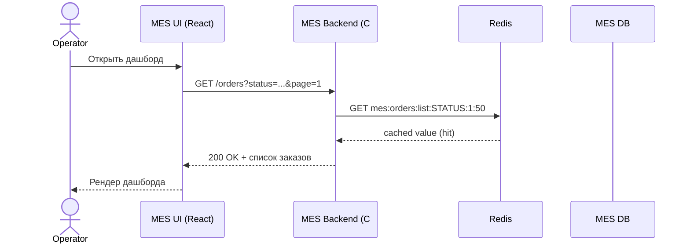
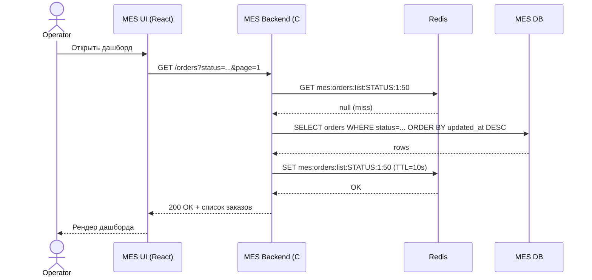
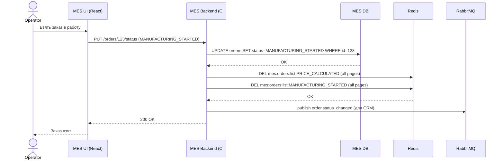

# Архитектурное решение по кешированию

## Мотивация

MES страдает от двух ключевых проблем:

- долгие ответы при открытии первой страницы операторов (список заказов с фильтрами и пагинацией);
- высокая латентность жизненного цикла заказа (в том числе из‑за тяжёлых операций расчёта и частых обращений к БД/MES API).

Кеширование должно:

- снизить нагрузку на БД MES и ускорить работу дашборда операторов (чтение «свежих заказов в работе»);
- уменьшить время ответа MES API для часто читаемых данных, не изменяющихся каждую секунду;
- дать предсказуемое время ответа даже при росте числа заказов.

Элементы, которые планируется кешировать:

- список «последних/активных заказов» по статусам для дашборда операторов (read‑heavy, обновляется событиями статусов, но не каждую миллисекунду);
- агрегированные/предрасчитанные представления (CQRS‑стиль) для быстрых выборок: например, «заказы в статусах `MANUFACTURING_STARTED` / `PACKAGING` / `PRICE_CALCULATED`» с сортировкой по времени создания/изменения;
- справочники и относительно статичные данные в MES/CRM (типы изделий, настройки производства и т. д.).

Расчёт стоимости 3D‑модели как таковой — CPU‑ёмкая операция, но кешировать конкретные результаты имеет смысл точечно и отдельно (по хешу 3D‑модели); это можно вынести как вторую очередь инициатив, а сейчас сосредоточиться на дашборде операторов.

## Предлагаемое решение

### Тип кеширования и паттерн

Основной упор — **серверное кеширование**.

**Клиентское кеширование** (HTTP‑кеш на фронтенде, браузерный кеш) мало помогает, потому что:

- операторам нужно видеть актуальные новые заказы, от этого зависит их вознаграждение;
- данные должны быть консистентны для всех операторов (shared view), а не локально в браузере.

**Серверный кеш** позволяет:

- иметь общее кэшированное представление «активных заказов»;
- гибко управлять инвалидацией по событиям и TTL;
- разгрузить БД MES.

Для кеша дашборда выбирается **Cache-Aside (lazy loading)** с элементами event‑based инвалидации по ключу, потому что:

- Cache-Aside хорошо подходит для read‑heavy сценариев, где данные можно безопасно брать из БД при кэш‑миссе, а обновления происходят «обычным путём» в БД.
- **Write-Through** усложнит и замедлит все операции записи статусов (любое изменение будет писать и в БД, и в кеш синхронно), что критично для MES, где много статусов и фоновых операций.
- **Refresh-Ahead** усложняет реализацию и даёт выигрыш при очень предсказуемых и часто повторяющихся запросах к одному и тому же ключу; для списка «самых свежих заказов», где набор ключей постоянно меняется, польза меньшая, чем сложность и накладные расходы.

Для потенциального кеширования результатов расчёта цены на сложные 3D‑модели можно позже рассмотреть сочетание Cache-Aside + Refresh-Ahead (если часто пересчитывается цена для одинаковых моделей).

### Где и как кешируем (MES дашборд)

Цель — ускорить операцию «получить список последних/активных заказов по статусу» для операторов MES.

**Стек:**

- **Redis** как внешний in‑memory кеш (Managed Redis в Yandex Cloud).
- C#‑бэкенд MES использует библиотеку‑обёртку (клиент `StackExchange.Redis`) и реализует паттерн Cache-Aside.

**Ключи кеша:**

- `mes:orders:list:{status}:{page}:{pageSize}` — список order_id (и краткая инфа) для дашборда;
- TTL для таких ключей — небольшой (например, 5–15 секунд), плюс программная инвалидация по событиям изменения статуса.

**Данные в кеше:**

- для каждого списка — только «тонкое» представление: `order_id`, текущий статус, время последнего изменения, оператор (если есть), краткие атрибуты;
- если нужны детали, фронтенд/бэкенд делает отдельный запрос, который также можно кешировать отдельным ключом `mes:order:details:{order_id}` с более длинным TTL.

### Диаграмма последовательности действий

**Чтение списка заказов — Cache-Aside, альтернатива A: cache hit.**

**Чтение списка заказов — Cache-Aside, альтернатива B: cache miss.**

**Изменение статуса заказа — инвалидация по ключу.**

Участники: Operator, MES UI, MES Backend, MES DB, Cache (Redis), RabbitMQ (для нотификации CRM).

Аналогично инвалидация работает при обработке сообщений из RabbitMQ — когда новый заказ приходит через Shop API / B2B или статус меняется со стороны CRM. Консьюмер MES обновляет запись в БД и удаляет соответствующие ключи кеша, чтобы оператор увидел свежий список при следующем обновлении дашборда.

### Стратегия инвалидации кеша

Используется **сочетание двух стратегий**:

- **инвалидация по ключу (event‑based)** — при изменении статуса заказа, которое может повлиять на списки;
- **временная (TTL)** — чтобы ограничить срок жизни каждого списка и избежать долгого накопления рассинхрона.

**Таблица сравнения стратегий инвалидации:**

| Стратегия | Плюсы | Минусы / особенности | Почему подходит / не подходит для MES дашборда |
| --- | --- | --- | --- |
| Временная (TTL only) | Простая реализация, не требует учёта событий | Возможна заметно устаревшая информация до истечения TTL; выбор TTL — компромисс между свежестью и нагрузкой | В одиночку не подходит: операторам нужна почти актуальная картина |
| По ключу (event‑based) | Точные инвалидации сразу после изменения данных | Сложнее реализовать, нужно знать, какие ключи затронуты; возможны пропуски при сбоях | Хорошо подходит, если дополняется TTL как «страховкой» |
| Программная / ручная (админские очистки, кнопки) | Гибкий ручной контроль, полезно для аварий и редких кейсов | Непригодна как основная стратегия; человеческий фактор | Используется дополнительно, но не как основная |
| Смешанная (TTL + по ключу) | Баланс между свежестью и устойчивостью, авто‑очистка | Чуть более сложная реализация и конфигурация TTL | **Оптимальный выбор** для списка заказов MES |

### Варианты решений (дополнительно)

#### Вариант 1: кеш только на уровне MES (Redis + Cache-Aside)

**Описание:** как описано выше — серверный кеш в MES, Redis, Cache-Aside, TTL + инвалидация по ключу через код MES.

**Плюсы:**

- простая и локализованная реализация, минимум изменений в других системах;
- хорошо контролируемая логика, близко к бизнес‑коду;
- можно быстро внедрить и протестировать.

**Минусы:**

- только MES‑дашборд ускоряется; CRM и другие системы по‑прежнему ходят напрямую в БД;
- нужен отдельный сервис Redis и DevOps‑поддержка.

#### Вариант 2: общий кеш‑слой / проекции (CQRS read‑модель)

**Описание:** выделить отдельный read‑сервис/проекцию заказов (отдельная БД/индекс или Redis‑кластер), который получает события из RabbitMQ (status‑update и т. п.) и хранит оптимизированные под чтение представления. MES UI / CRM UI читают только из этого read‑сервиса.

**Плюсы:**

- одно место для всех скоростных чтений (MES, CRM, возможно B2B‑отчёты);
- можно делать сложные дашборды без нагрузки на основные БД.

**Минусы:**

- значительно более сложная архитектура (новый сервис, схема событий, миграции);
- дольше внедрение, больше рисков рассинхронизации при ошибках обработки событий.

#### Таблица сравнения решений

| Критерий | Решение 1: кеш в MES (Redis, Cache-Aside) | Решение 2: отдельный read‑сервис / проекция |
| --- | --- | --- |
| Описание | Локальный серверный кеш в MES для списков заказов, TTL + инвалидация по ключу | Отдельный сервис/хранилище, потребляющий события и предоставляющий быстрые чтения |
| Плюсы | Быстро реализуется, минимум затронутых компонентов, ясная ответственность | Общий слой чтения, масштабируемость, гибкие дашборды |
| Минусы | Локальный по отношению к MES, дублирование логики кеша в других сервисах | Высокая сложность, необходимость продуманной событийной модели |
| Когда лучше | Сейчас, для быстрого снижения жалоб операторов | В следующей фазе, когда нужно масштабировать отчётность и аналитику |

#### Вывод

Для горизонта ближайших месяцев и текущих болей (медленный MES‑дашборд, жалобы операторов) больше подходит **Решение 1: серверный кеш в MES с паттерном Cache-Aside и смешанной TTL + key‑based инвалидацией**. Оно быстрее даёт бизнес‑эффект и требует меньше архитектурных изменений, а более сложный read‑сервис можно рассматривать как следующий шаг эволюции архитектуры.
